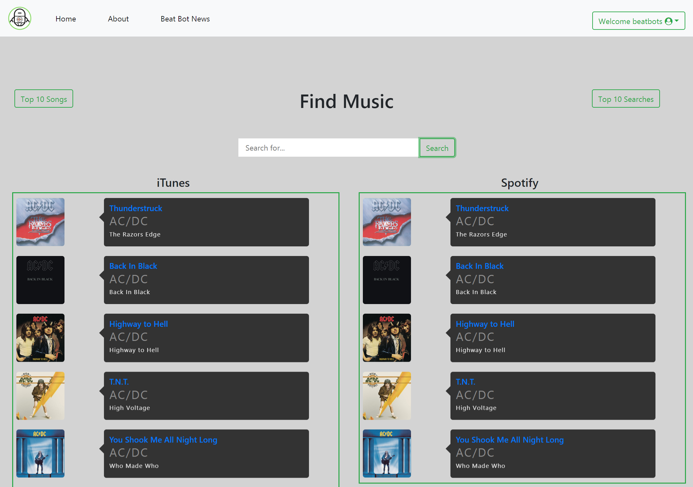

# BeatBot
The best place to find your music

## About
BeatBot is a student collaboration project for a web development bootcamp. The goal of this project is to demonstrate the learnings with Node/Express Web Server, the CRUD(Create,Read,Update, Delete) Method using relational Database(MySQL).

The intent of this site concept is to offer a user the experience in finding there favourite music from iTunes or Spotify.

## Dependencies
1. Express : https://expressjs.com/
2. Express-handlebars : https://www.npmjs.com/package/express-handlebars
3. Express-session : https://www.npmjs.com/package/express-session
4. Passport : https://www.npmjs.com/package/passport
5. Passport-local : https://www.npmjs.com/package/passport-local
6. Sequelize : https://www.npmjs.com/package/sequelize
7. Mocha :https://mochajs.org/
8. Chai : http://chaijs.com/
9. Connect-Flash : https://www.npmjs.com/package/connect-flash
10. Itunes : https://www.npmjs.com/package/itunes-search
11. MySQL2 : https://www.npmjs.com/package/mysql2
12. bcrypt : https://www.npmjs.com/package/bcrypt
13. Spotify : https://www.npmjs.com/package/spotify-web-api-node
## Deployed Site
https://beatbot-ucsd.herokuapp.com/
## Walkthrough
Navigate to BeatBot(https://beatbot-ucsd.herokuapp.com/). On the front page , the user will see the login page. If there already an existing user they can sign in using there username and password. If they are a new user they can click on the Create Account button and they can register for BeatBot.

When creating an account, the user is to sign up using there username, email and password. After this process is complete, they are directed to the user profile page. 

On the top right navigation bar, there is a logo of beatBot followed by three options which are Home, About and BeatBot News. 

When the About is clicked a modal with the authors who developed the page gets displayed. 

When the BeatBot News is clicked a modal with the latest news from BeatBot gets displayed.

On the top left navigation bar, a Welcome User will be displayed with a dropdown for logging out of the webpage.

The main area of the webpage is used for searching for the favourite song of the user. Once the search happens , the favourite song from iTunes and Spotify gets displayed. 

In the main area on the left side the Top 10 Songs of all Time  will get displayed as a modal when the button is clicked.

In the main area on the right side the Top 10 Searched can be viewed by clicking on the button and gets displayed as a modal. The seach can be cleared when clicked on clear history button. 

The user can log out when clicked on the Logout button and will be navigated to the signup page.

## Screenshot of the app

## Authors

Sahana Balram : https://github.com/sahanabalram
 
Kevin Lussier : https://github.com/kluss
 
Bryan Liu : https://github.com/boyuanl1
 
Richard Selnick : https://github.com/richardselz  

